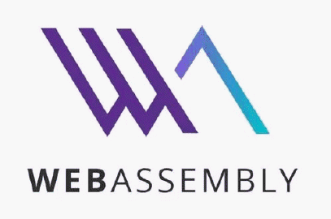
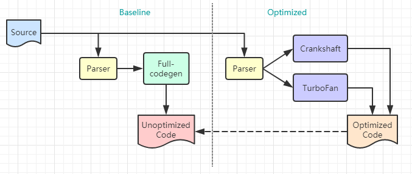
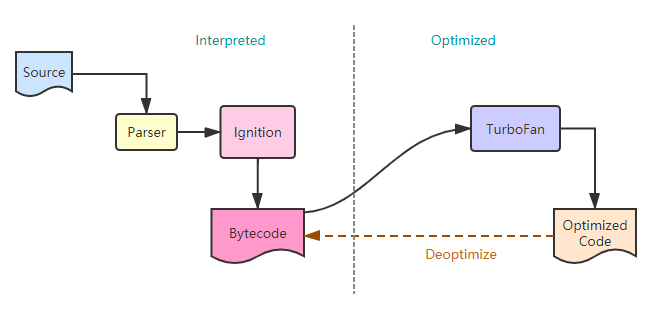
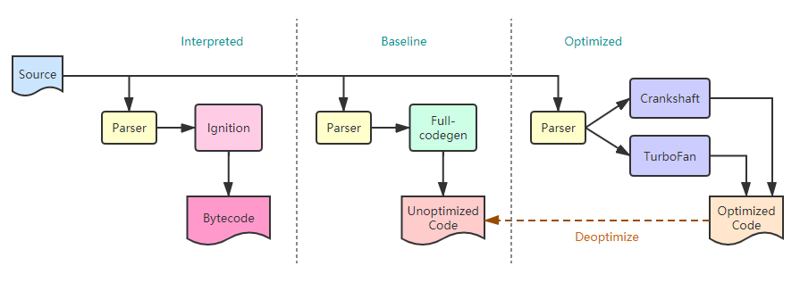

# WebAssembly
let C/C++ to run in the browser    
简书优质文章 https://www.jianshu.com/p/bff8aa23fe4d    

## 深入浅出 WebAssembly 观书有感 & 学习笔记

Github链接：https://github.com/Becavalier/Book-DISO-WebAssembly

### 序言 & 第一章 漫谈WebAssembly发展史

#### 2019.09.17

> 首先，吐槽一下，第一章漫谈发展史，一谈就是90页，这也太漫了吧，截至今天才看到 17页 －_－b    
> 虽然刚看到17页，出身计算机专业的我感觉内容已经硬核到快啃不动了，好家伙编译原理没学好的连发展史都无法了解吗？    

以下进入正题，整理今日份学习笔记：

**序言**
- WebAssembly是一种新型的二进制格式，文件体积更小，启动速度&运行速度更快；
WebAssembly是多种编程语言的编译目标，包括C和C++；
WebAssembly开始被应用于Web浏览器之外的领域，如区块链和内容分发网络(CDN);
最初出现在Firefox中的ASM.js让业界开始关注于解决跨浏览器协作，以便让原生代码运行在浏览器上；
WebAssembly会在将来添加多线程，SIMD，GC等功能，这些新特性将带来更多的可能性；
WebAssembly的出现让我们能够以极小的成本来复用其他领域已存在的成果，以此弥补JS性能与功能上的不足。

**前言**
- JS本身作为一种弱类型语言，相比于C/C++等强类型语言，尽管Chrome V8，SpiderMonkey等JS引擎已经通过诸如JIT等技术手段来优化JS脚本代码的整体执行效率，
但引擎每一次每一次版本优化的迭代速度却远跟不上当今各类Web应用的复杂度变化。因此，发明一种能够根本上解决该问题的技术迫在眉睫。

- 昙花一现的ASM.js，NaCl，PNaCl等技术都尝试以各自的方式来优化Web应用的执行效率，但由于诸如“浏览器兼容性不佳”，“性能优化不彻底”等问题，导致最终没有被广泛推广。而在2015年出现的WebAssembly(简称Wasm)，便是在吸取了前者的经验教训的基础上被设计和发明出来的。现在，W3C成立了专门的WWG工作组负责WebAssembly技术的标准迭代与实现，四大主流浏览器(Chrome,Firefox,Edge,Safair)已经全部实现WebAssembly技术在其MVP标准中的制定的所有特性，C/C++,Go和Rust等高级语言已经逐渐开始支持编译到Wasm格式。

**第一章正文**

- 基准测试 **P8**
  - 测试代码：浮点数累加一亿次，并循环执行10次
  - 参与测试的语言：C++(包括经过编译器优化和浮点数操作优化和未经过任何优化的)，Java，JS，Python
  - 平均耗时结果：优化后的C++ 3ms，Java 103ms，JS 105ms，未经优化的C++ 306ms，Python  6022ms    

- Web新时代与挑战 **P11**    

框架在一些必要的业务流程上已经做了足够多的封装和优化，是我们能更多的关注业务逻辑的实现，而不是一些底层的架构细节。但事情并没有那么完美，以Node.js为例，由于其本身基于V8实现，而V8最重要的功能就是对JS代码进行解析和优化，然后将优化好的中间代码编译成机器码或其他格式后在进行处理。因此，无论Node.js对V8上层的JS代码进行了何种底层系统调用流程上的优化，如果最后V8在解析和优化JS代码的过程中消耗了大量时间，那么整个应用的运行效率必然会大打折扣。总的来说，Chrome V8，JavaScriptCore和SpiderMonkey等JS引擎对JS代码的解析和优化效率，直接决定了基于JS开发的前端和服务器端应用的运行效率和用户体验。此外，日益庞大的Web前端应用给JS语言性能上带来的挑战，日益复杂的页面交互带来巨大的DOM节点修改成本也是未来我们要面对的问题。

- 非终结符、终结符与产生式 **P16**

终结符：词法分析中产生的最小的且具有明确语义的有效关键字(Token)。    

用S表示表达式，v表示变量，e表示=，d表示整数，p表示+，E表示非终结符，则加法运算结果赋值给一个变量的产生式如下：    

E -> d|Epd  (非终结符展开)    
S -> ve(d|Epd)    

表达式S：aVariable = 1+2+3; 

#展开过程 ( **勘误** )    

1. S -> veE (E -> Epd)    
2. S -> veEpd (E -> Epd)    
3. S -> veEpdpd (E -> d)    
4. S -> vedpdpd

----------------------------------------------------------华丽丽的分界线-------------------------------------------------------

#### 2019.09.18

- 编译器链路 **P16+P22**

通常，在编程语言所对应的整个编译器链路中，词法分析器(Lexer)负责将源码中各类短语进行过滤并解析成具有特定语义的Token字符串，接下来，在语法分析阶段，这些字符串会被语法分析器(Parser)通过相应算法进行“表达式非终结符展开”的处理。如果语法分析器无法将一段代码内的某个表达式展开成标准中提到的任意一种终结符展开式形式，那么该表达式中一定存在语法错误。语法分析器在处理完代码后会向编译器链路的下一个阶段输出一种名为“抽象语法树(AST)”的数据结构，它以结构化的表示形式表达了整段代码的语法结构。至此也表明了语法分析器真正“理解”了源码中各代码段的具体语义。在随后的语义分析阶段，编译器会进一步分析AST，进而判断代码是否存在运行时错误，并做一些初步优化生成中间代码。最后编译器会将得到的中间代码直接编译成目标平台的机器码。

- 弱类型与强类型 **P16**

JS本身是一种弱类型(Weak Typed)的编程语言。所谓弱类型，在语法形式上的直观体现就是初始化变量时，无需显式指定变量类型，其类型完全由代码解释器在代码运行过程中进行推断。相对的，强类型(Strongly Typed)编程语言，最直观的体现是声明变量时，必须显式指定变量需要存储的数据类型。这样做的好处是，无须再花费额外的时间在代码运行时去推断变量的数据类型，这从某种程度上可以大大提高代码的运行效率。由于代码中的所有变量类型都不需要通过运行时环境推断，因此便可以提前将程序源码进行静态编译(AOT)和优化，最后直接生成相应的经过优化的二进制机器码供CPU执行。

- Chrome V8 引擎链路 **P17+P22**

    

老版本的Chrome V8(Chrome 58以下)，整个代码的解析，编译和执行过程流程，可以分为两个阶段：Baseline编译阶段和Optimized编译阶段。Baseline编译阶段由“Full-codegen”基线JIT编译器处理，Optimized编译阶段由“Crankshaft”和“TurboFan”两个优化JIT编译器处理。每一组编译器都有一个前置的语法分析器，对JS源码进行词法和语法分析，同时生成对应的AST数据结构。    

----------------------------------------------------------华丽丽的分界线-------------------------------------------------------

#### 2019.09.23

- Top-Level代码，非Top-Level代码 和 Lazy Parsing **P22+P23**

  为了提高对JS源代码的解析和执行效率，V8引擎会对当前即将执行的JS代码段进行分析。首先将所有的JS代码通过一个前置的语法分析器(Parser)来进行词法和语法分析，同时生成对应的AST数据结构。这一阶段，Parser会检查整段代码，并将它们分成两种不同的类型：Top-Level代码(TL)和非Top-Level代码(NTL)。    
    - Top-Level代码主要指JS源码初次加载时需要首先被运到顶层的代码。主要包括变量声明，函数定义以及函数调用等。    
    - 非Top-Level代码主要指函数体内部的JS代码。    

在V8引擎中，位于各个编译器的前置Parser被分为Pre-Parser与Full-Parser两种类型。    

首先，Pre-Parser主要负责对整个JS源代码段进行必要的前期检查。判断代码中是否存在语法错误，如果存在，则抛出语法错误信息(Early Syntax Error)并提示用户，同时中断代码的后续解析和运行。Pre-Parser对代码的分析处理阶段不会生成对应的AST，也不会生成变量可用的上下文作用域。    

接下来，Full-Parser会开始分析那些属于TL类型的JS源码并生成AST。同时会对代码中的变量进行作用域分析，以便追踪那些具有特殊作用域的变量(如闭包中的变量)，并为他们的外层作用域分配相应的资源，同时生成该变量可用的上下文作用域。当Full-Parser将所有的TL代码转换成AST后，这些AST随后便会被运往V8引擎的第一个支持运行时编译(JIT)的编译器——“Full-codegen”基线编译器进行处理。在这里，Full-codegen会快速的根据输入的AST信息来编译并生成对应的未经优化的机器码，这些机器码可以被浏览器快速的解析和执行。    

浏览器在解析和执行这些TL代码的过程中，会遇到一些诸如函数调用的操作。这时，V8引擎会根据TL代码在执行的过程中遇到的函数调用，对JS源码再进行一次Full-Parsing的处理，并生成对应的AST。随后，这些AST同样会被Full-codegen处理生成对应的机器码，最后再由浏览器解析和运行。    

V8这种"非一次性生成和处理所有JS代码源码对应的AST信息，而只在用到时才进行AST生成和编译"的特性，我们称之为“Lazy Parsing”。总的来说，在V8引擎中，Pre-Parsing阶段主要检查代码中是否存在语法错误，随后的Full-Parsing阶段才会真正生成AST信息交由编译器来处理。

- 优化&去优化 **P24**

  随着从Full-codegen基线编译器输出的未经优化的机器码被浏览器解析和执行，V8引擎会发现当前正在运行的代码逻辑中，有一些比较耗时的代码流程可以被进一步优化。比如在JS代码中出现的“大次数循环代码块”或ECMScript6标准中的某些新特性。这时V8引擎会将这部分代码转交给另外的优化编译器进行优化处理。V8引擎有两个JS优化编译器，分别是Crankshaft和TurboFan。其中Crankshaft主要对JS代码进行一些比较基础的优化；而TurboFan主要对耐饿使用了ES6及以上标准的新特性代码进行优化，同时它也负责对ASM.js代码进行处理。    

  Full-codegen基线编译器把编译流程交给优化编译器进行优化处理是建立在一些假设成立的基础上的，如Full-codegen在循环中的前几次中都执行了相同的逻辑代码(相同的作用域环境和变量结构)，那么Full-codegen会假设在后面的循环中，迭代的代码形式保持不变，于是将编译流程交给优化编译器。但实际上，由于JS语言的高度动态性，并不能保证这样的假设总是成立的。所以，这些经过优化编译器生彻骨的机器码在被浏览器解析执行前，V8引擎会检验之前的假设是否成立。成立则浏览器直接解析执行经过优化生成的机器码；不成立则优化编译器会开始进行一个名为“去优化”的过程。将代码的编译流程重新“交回”到基线编译器的手上。基线编译器会重新编译这些JS代码，同时生成为优化的机器码，最后让浏览器解析执行。而之前优化编译器生成的那部分错误的优化机器码便会被直接舍弃。    

  以上便是老的V8引擎的编译流程。随着Web应用的规模越来越大，V8的这种编译器架构模式的问题逐渐凸显：    
    - Full-codegen基线编译器在处理TL代码时产生的机器码大量占用V8的堆内存。
    - V8的编译器链路在解析和执行JS代码的整个时间线(Startup Time)上，有近三分之一的时间被Paring和Compiling占据。
    - 对同一段代码的多次Pasing大大降低了V8的处理效率(Pre-Parsing,基线编译器的Full-Parsing,优化编译器的Full-Parsing)。    
  
V8也提供了一些比较“Hack”的方式来避免多余的Pre-parsing过程——IIFE(立即执行函数表达式)形式的代码(の其实好像就是字面量函数吧)。强制让V8省略对IIFE内部代码的Pre-parsing过程。

----------------------------------------------------------华丽丽的分界线-------------------------------------------------------

#### 2019.09.24

- 全新的V8引擎编译器链路 **P27**    

  

如上图，鉴于老版本V8存在的问题，Google自Chrome58版本开始，对V8引擎的编译器链路进行了改进和优化。    
在V8团队**所！希！望！的**全新的V8引擎的编译器链路里，新加入了一个名为“Ignition”的解释器，同时去掉了Full-codegen基线编译器和Crankshaft优化编译器。    

Ignition解释器会根据Parser传递过来的AST直接生成对应的“比特码(Bytecode)”数据结构(の好像很多地方都叫字节码的吧，我想应该就是字节码吧)。比特码本身是一种机器码形式的抽象，他的信息密度更高，所以相比基线编译器生成未经优化的机器码，Ignition解释器生成比特码的速度更快，同时生成的比特码提及更小，占用堆内存更少。    

这些比特码一部分会直接被Ignition直接高效的解释执行，另一部分会送往TurboFan的“图”生成器等待进一步优化。类似的，如果优化假设不成立，TurboFan生成的优化后的机器码会被直接舍弃，编译流程会再次返回到Ignition解释器。    

新的编译链路使V8整体架构的复杂度大幅降低，仅一次Parsing过程也使运行更加高效，同时也解决了大量耗费堆内存的问题。    

  

**但！实！际！上**，链路架构升级并不是一蹴而就的。如上图，由于TurboFan优化编译器本身的处理性能并不足以支撑整个V8链路对JS的优化，因此不得不把Crankshaft优化编译器重新加回到链路中。另一方面，由于Crankshaft本身没有可以处理比特码的编译器前端，因此Crankshaft的去优化过程仍需要把部分代码交给到Full-codegen基线编译器，所以Full-codegen也被重新加回到链路中。(の这让我怎么说，，，理想很骨感，现实很臃肿。)    

可见，随着Web应用的规模不断增大，V8引擎需要不断进行升级来提升自己处理JS的能力。但每次升级需要的时间却和Web应用复杂化的周期不成正比。并且V8引擎所存在的问题并不是其独有的。包括SpiderMonkey和JavaScriptCode等在内的这些常见的JS引擎军存在类似的问题。    

----------------------------------------------------------华丽丽的分界线-------------------------------------------------------

#### 2019.09.26

- 失落的ASM.js **P28-P30**

为了降低JS引擎在运行时推断变量类型的开销，基于JIT的优化编译器通常会使用“类型特化”这种方法来优化代码执行。大概意思是基线编译器将含有大量循环逻辑的JS代码标记为“warm/hot”即热代码，并假设在循环内部所有次迭代中，这段代码运行时上下文环境内各变量的类型都不发生变化，则优化编译器在优化这段代码时，不会再为循环体后面若干迭代中的变量进行类型推断了，这样便部分提高了代码的整体执行效率。    

所以同理，如果代码运行前就告诉编译器各个变量的具体类型，同时保证这些变量类型不会再变化，那么就可以完全省去类型推断，甚至优化编译器也可以省略优化过程。整个Web应用的运行效率将大幅提升。ASM.js由此而生。    

> ASM.js标准始于2013年8月，它是JS的一个严格子集，是一种可用于编译器的底层级，高效的目标语言。该子语言有效的为内存不安全语言(如C/C++)描述了一个沙盒虚拟机的运行环境。一种静态和动态验证相结合的方式是的JS引擎能够使用AOT(Ahead-Of-Time,静态编译)的优化编译策略来验证ASM.js的代码。

ASM.js本质上还是JS。相较于JS，ASM.js使用了一种叫做“Annotation(注解)”的变量类型声明方式来与JS引擎约定变量类型。在ASM.js的语法规则中，变量，函数的参数，return返回的结果都强制要求通过Annotation方式进行类型声明。    

