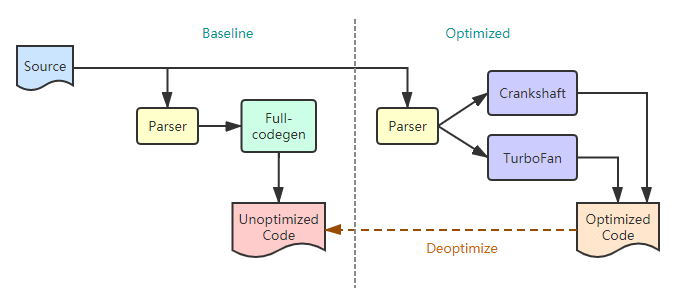
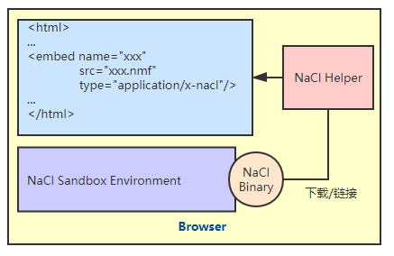
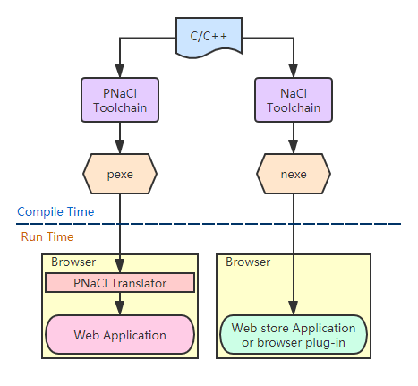
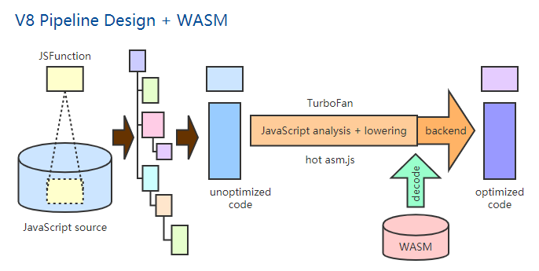
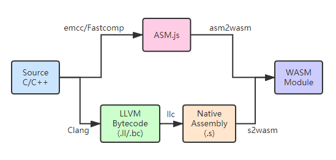

# WebAssembly
let C/C++ to run in the browser    
简书优质文章    
几张图让你看懂WebAssembly https://www.jianshu.com/p/bff8aa23fe4d    
深入浅出让你理解什么是LLVM https://www.jianshu.com/p/1367dad95445    


## 深入浅出 WebAssembly 观书有感 & 学习笔记

Github链接：https://github.com/Becavalier/Book-DISO-WebAssembly

### 序言 & 第一章 漫谈WebAssembly发展史

#### 2019.09.17

> 首先，吐槽一下，第一章漫谈发展史，一谈就是90页，这也太漫了吧，截至今天才看到 17页 －_－b    
> 虽然刚看到17页，出身计算机专业的我感觉内容已经硬核到快啃不动了，好家伙编译原理没学好的连发展史都无法了解的吗？    

以下进入正题，整理今日份学习笔记：

**序言**
- WebAssembly是一种新型的二进制格式，文件体积更小，启动速度&运行速度更快；
WebAssembly是多种编程语言的编译目标，包括C和C++；
WebAssembly开始被应用于Web浏览器之外的领域，如区块链和内容分发网络(CDN);
最初出现在Firefox中的ASM.js让业界开始关注于解决跨浏览器协作，以便让原生代码运行在浏览器上；
WebAssembly会在将来添加多线程，SIMD，GC等功能，这些新特性将带来更多的可能性；
WebAssembly的出现让我们能够以极小的成本来复用其他领域已存在的成果，以此弥补JS性能与功能上的不足。

**前言**
- JS本身作为一种弱类型语言，相比于C/C++等强类型语言，尽管Chrome V8，SpiderMonkey等JS引擎已经通过诸如JIT等技术手段来优化JS脚本代码的整体执行效率，
但引擎每一次每一次版本优化的迭代速度却远跟不上当今各类Web应用的复杂度变化。因此，发明一种能够根本上解决该问题的技术迫在眉睫。

- 昙花一现的ASM.js，NaCl，PNaCl等技术都尝试以各自的方式来优化Web应用的执行效率，但由于诸如“浏览器兼容性不佳”，“性能优化不彻底”等问题，导致最终没有被广泛推广。而在2015年出现的WebAssembly(简称Wasm)，便是在吸取了前者的经验教训的基础上被设计和发明出来的。现在，W3C成立了专门的WWG工作组负责WebAssembly技术的标准迭代与实现，四大主流浏览器(Chrome,Firefox,Edge,Safair)已经全部实现WebAssembly技术在其MVP标准中的制定的所有特性，C/C++,Go和Rust等高级语言已经逐渐开始支持编译到Wasm格式。

**第一章正文**

- 基准测试 **P8**
  - 测试代码：浮点数累加一亿次，并循环执行10次
  - 参与测试的语言：C++(包括经过编译器优化和浮点数操作优化和未经过任何优化的)，Java，JS，Python
  - 平均耗时结果：优化后的C++ 3ms，Java 103ms，JS 105ms，未经优化的C++ 306ms，Python  6022ms    

- Web新时代与挑战 **P11**    

框架在一些必要的业务流程上已经做了足够多的封装和优化，是我们能更多的关注业务逻辑的实现，而不是一些底层的架构细节。但事情并没有那么完美，以Node.js为例，由于其本身基于V8实现，而V8最重要的功能就是对JS代码进行解析和优化，然后将优化好的中间代码编译成机器码或其他格式后在进行处理。因此，无论Node.js对V8上层的JS代码进行了何种底层系统调用流程上的优化，如果最后V8在解析和优化JS代码的过程中消耗了大量时间，那么整个应用的运行效率必然会大打折扣。总的来说，Chrome V8，JavaScriptCore和SpiderMonkey等JS引擎对JS代码的解析和优化效率，直接决定了基于JS开发的前端和服务器端应用的运行效率和用户体验。此外，日益庞大的Web前端应用给JS语言性能上带来的挑战，日益复杂的页面交互带来巨大的DOM节点修改成本也是未来我们要面对的问题。

- 非终结符、终结符与产生式 **P16**

终结符：词法分析中产生的最小的且具有明确语义的有效关键字(Token)。    

用S表示表达式，v表示变量，e表示=，d表示整数，p表示+，E表示非终结符，则加法运算结果赋值给一个变量的产生式如下：    

E -> d|Epd  (非终结符展开)    
S -> ve(d|Epd)    

表达式S：aVariable = 1+2+3; 

#展开过程 ( **勘误** )    

1. S -> veE (E -> Epd)    
2. S -> veEpd (E -> Epd)    
3. S -> veEpdpd (E -> d)    
4. S -> vedpdpd

----------------------------------------------------------华丽丽的分界线-------------------------------------------------------

#### 2019.09.18

- 编译器链路 **P16+P22**

通常，在编程语言所对应的整个编译器链路中，词法分析器(Lexer)负责将源码中各类短语进行过滤并解析成具有特定语义的Token字符串，接下来，在语法分析阶段，这些字符串会被语法分析器(Parser)通过相应算法进行“表达式非终结符展开”的处理。如果语法分析器无法将一段代码内的某个表达式展开成标准中提到的任意一种终结符展开式形式，那么该表达式中一定存在语法错误。语法分析器在处理完代码后会向编译器链路的下一个阶段输出一种名为“抽象语法树(AST)”的数据结构，它以结构化的表示形式表达了整段代码的语法结构。至此也表明了语法分析器真正“理解”了源码中各代码段的具体语义。在随后的语义分析阶段，编译器会进一步分析AST，进而判断代码是否存在运行时错误，并做一些初步优化生成中间代码。最后编译器会将得到的中间代码直接编译成目标平台的机器码。

- 弱类型与强类型 **P16**

JS本身是一种弱类型(Weak Typed)的编程语言。所谓弱类型，在语法形式上的直观体现就是初始化变量时，无需显式指定变量类型，其类型完全由代码解释器在代码运行过程中进行推断。相对的，强类型(Strongly Typed)编程语言，最直观的体现是声明变量时，必须显式指定变量需要存储的数据类型。这样做的好处是，无须再花费额外的时间在代码运行时去推断变量的数据类型，这从某种程度上可以大大提高代码的运行效率。由于代码中的所有变量类型都不需要通过运行时环境推断，因此便可以提前将程序源码进行静态编译(AOT)和优化，最后直接生成相应的经过优化的二进制机器码供CPU执行。

- Chrome V8 引擎链路 **P17+P22**

    

老版本的Chrome V8(Chrome 58以下)，整个代码的解析，编译和执行过程流程，可以分为两个阶段：Baseline编译阶段和Optimized编译阶段。Baseline编译阶段由“Full-codegen”基线JIT编译器处理，Optimized编译阶段由“Crankshaft”和“TurboFan”两个优化JIT编译器处理。每一组编译器都有一个前置的语法分析器，对JS源码进行词法和语法分析，同时生成对应的AST数据结构。    


----------------------------------------------------------华丽丽的分界线-------------------------------------------------------

#### 2019.09.23

- Top-Level代码，非Top-Level代码 和 Lazy Parsing **P22+P23**

  为了提高对JS源代码的解析和执行效率，V8引擎会对当前即将执行的JS代码段进行分析。首先将所有的JS代码通过一个前置的语法分析器(Parser)来进行词法和语法分析，同时生成对应的AST数据结构。这一阶段，Parser会检查整段代码，并将它们分成两种不同的类型：Top-Level代码(TL)和非Top-Level代码(NTL)。    
    - Top-Level代码主要指JS源码初次加载时需要首先被运到顶层的代码。主要包括变量声明，函数定义以及函数调用等。    
    - 非Top-Level代码主要指函数体内部的JS代码。    

在V8引擎中，位于各个编译器的前置Parser被分为Pre-Parser与Full-Parser两种类型。    

首先，Pre-Parser主要负责对整个JS源代码段进行必要的前期检查。判断代码中是否存在语法错误，如果存在，则抛出语法错误信息(Early Syntax Error)并提示用户，同时中断代码的后续解析和运行。Pre-Parser对代码的分析处理阶段不会生成对应的AST，也不会生成变量可用的上下文作用域。    

接下来，Full-Parser会开始分析那些属于TL类型的JS源码并生成AST。同时会对代码中的变量进行作用域分析，以便追踪那些具有特殊作用域的变量(如闭包中的变量)，并为他们的外层作用域分配相应的资源，同时生成该变量可用的上下文作用域。当Full-Parser将所有的TL代码转换成AST后，这些AST随后便会被运往V8引擎的第一个支持运行时编译(JIT)的编译器——“Full-codegen”基线编译器进行处理。在这里，Full-codegen会快速的根据输入的AST信息来编译并生成对应的未经优化的机器码，这些机器码可以被浏览器快速的解析和执行。    

浏览器在解析和执行这些TL代码的过程中，会遇到一些诸如函数调用的操作。这时，V8引擎会根据TL代码在执行的过程中遇到的函数调用，对JS源码再进行一次Full-Parsing的处理，并生成对应的AST。随后，这些AST同样会被Full-codegen处理生成对应的机器码，最后再由浏览器解析和运行。    

V8这种"非一次性生成和处理所有JS代码源码对应的AST信息，而只在用到时才进行AST生成和编译"的特性，我们称之为“Lazy Parsing”。总的来说，在V8引擎中，Pre-Parsing阶段主要检查代码中是否存在语法错误，随后的Full-Parsing阶段才会真正生成AST信息交由编译器来处理。

- 优化&去优化 **P24**

  随着从Full-codegen基线编译器输出的未经优化的机器码被浏览器解析和执行，V8引擎会发现当前正在运行的代码逻辑中，有一些比较耗时的代码流程可以被进一步优化。比如在JS代码中出现的“大次数循环代码块”或ECMScript6标准中的某些新特性。这时V8引擎会将这部分代码转交给另外的优化编译器进行优化处理。V8引擎有两个JS优化编译器，分别是Crankshaft和TurboFan。其中Crankshaft主要对JS代码进行一些比较基础的优化；而TurboFan主要对耐饿使用了ES6及以上标准的新特性代码进行优化，同时它也负责对ASM.js代码进行处理。    

  Full-codegen基线编译器把编译流程交给优化编译器进行优化处理是建立在一些假设成立的基础上的，如Full-codegen在循环中的前几次中都执行了相同的逻辑代码(相同的作用域环境和变量结构)，那么Full-codegen会假设在后面的循环中，迭代的代码形式保持不变，于是将编译流程交给优化编译器。但实际上，由于JS语言的高度动态性，并不能保证这样的假设总是成立的。所以，这些经过优化编译器生彻骨的机器码在被浏览器解析执行前，V8引擎会检验之前的假设是否成立。成立则浏览器直接解析执行经过优化生成的机器码；不成立则优化编译器会开始进行一个名为“去优化”的过程。将代码的编译流程重新“交回”到基线编译器的手上。基线编译器会重新编译这些JS代码，同时生成为优化的机器码，最后让浏览器解析执行。而之前优化编译器生成的那部分错误的优化机器码便会被直接舍弃。    

  以上便是老的V8引擎的编译流程。随着Web应用的规模越来越大，V8的这种编译器架构模式的问题逐渐凸显：    
    - Full-codegen基线编译器在处理TL代码时产生的机器码大量占用V8的堆内存。
    - V8的编译器链路在解析和执行JS代码的整个时间线(Startup Time)上，有近三分之一的时间被Paring和Compiling占据。
    - 对同一段代码的多次Pasing大大降低了V8的处理效率(Pre-Parsing,基线编译器的Full-Parsing,优化编译器的Full-Parsing)。    
  
V8也提供了一些比较“Hack”的方式来避免多余的Pre-parsing过程——IIFE(立即执行函数表达式)形式的代码(の其实好像就是字面量函数吧)。强制让V8省略对IIFE内部代码的Pre-parsing过程。

----------------------------------------------------------华丽丽的分界线-------------------------------------------------------

#### 2019.09.24

- 全新的V8引擎编译器链路 **P27**    

  

如上图，鉴于老版本V8存在的问题，Google自Chrome58版本开始，对V8引擎的编译器链路进行了改进和优化。    
在V8团队**所！希！望！的**全新的V8引擎的编译器链路里，新加入了一个名为“Ignition”的解释器，同时去掉了Full-codegen基线编译器和Crankshaft优化编译器。    

Ignition解释器会根据Parser传递过来的AST直接生成对应的“比特码(Bytecode)”数据结构(の好像很多地方都叫字节码的吧，我想应该就是字节码吧)。比特码本身是一种机器码形式的抽象，他的信息密度更高，所以相比基线编译器生成未经优化的机器码，Ignition解释器生成比特码的速度更快，同时生成的比特码提及更小，占用堆内存更少。    

这些比特码一部分会直接被Ignition直接高效的解释执行，另一部分会送往TurboFan的“图”生成器等待进一步优化。类似的，如果优化假设不成立，TurboFan生成的优化后的机器码会被直接舍弃，编译流程会再次返回到Ignition解释器。    

新的编译链路使V8整体架构的复杂度大幅降低，仅一次Parsing过程也使运行更加高效，同时也解决了大量耗费堆内存的问题。    

  

**但！实！际！上**，链路架构升级并不是一蹴而就的。如上图，由于TurboFan优化编译器本身的处理性能并不足以支撑整个V8链路对JS的优化，因此不得不把Crankshaft优化编译器重新加回到链路中。另一方面，由于Crankshaft本身没有可以处理比特码的编译器前端，因此Crankshaft的去优化过程仍需要把部分代码交给到Full-codegen基线编译器，所以Full-codegen也被重新加回到链路中。(の这让我怎么说，，，理想很骨感，现实很臃肿。)    

可见，随着Web应用的规模不断增大，V8引擎需要不断进行升级来提升自己处理JS的能力。但每次升级需要的时间却和Web应用复杂化的周期不成正比。并且V8引擎所存在的问题并不是其独有的。包括SpiderMonkey和JavaScriptCode等在内的这些常见的JS引擎军存在类似的问题。    

> 至此算是结束了第一个小主题——从Chrome V8编译链路的角度认识JS代码在浏览器中的整个编译过程。   
> 我感觉通过这部分内容，我顺带的回忆了一遍编译原理的相关内容，内容好干啊－_－b。    
> 另外我强烈建议看完这部分之后再去阅读一下我放在文章一开始的那篇文章：简书优质文章 https://www.jianshu.com/p/bff8aa23fe4d     
> 更加全方位的理解一下，顺便再通过这篇简书回忆下计算机组成原理的相关内容=￣ω￣=。    
> 接下来是Wasm出现前的几项技术介绍，可能算是技术前身吧，不是重要内容，节奏会加快很多，简单了解即可。

----------------------------------------------------------华丽丽的分界线-------------------------------------------------------

#### 2019.09.26

- 失落的ASM.js **P28-P42**

为了降低JS引擎在运行时推断变量类型的开销，基于JIT的优化编译器通常会使用“类型特化”这种方法来优化代码执行。大概意思是基线编译器将含有大量循环逻辑的JS代码标记为“warm/hot”即热代码，并假设在循环内部所有次迭代中，这段代码运行时上下文环境内各变量的类型都不发生变化，则优化编译器在优化这段代码时，不会再为循环体后面若干迭代中的变量进行类型推断了，这样便部分提高了代码的整体执行效率。    

所以同理，如果代码运行前就告诉编译器各个变量的具体类型，同时保证这些变量类型不会再变化，那么就可以完全省去类型推断，甚至优化编译器也可以省略优化过程。整个Web应用的运行效率将大幅提升。ASM.js由此而生。    

> ASM.js标准始于2013年8月，它是JS的一个严格子集，是一种可用于编译器的底层级，高效的目标语言。该子语言有效的为内存不安全语言(如C/C++)描述了一个沙盒虚拟机的运行环境。一种静态和动态验证相结合的方式是的JS引擎能够使用AOT(Ahead-Of-Time,静态编译)的优化编译策略来验证ASM.js的代码。

ASM.js本质上还是JS。相较于JS，ASM.js使用了一种叫做“Annotation(注解)”的变量类型声明方式来与JS引擎约定变量类型。在ASM.js的语法规则中，变量，函数的参数，return返回的结果都强制要求通过Annotation方式进行类型声明。    

ASM.js需要设置独立的运行时堆内存，这是由于标准的ASM.js模块被JS引擎解析执行前就经过了AOT处理被编译成静态代码，这部分代码有固定的可用内存段。模块运行时对变量的内存分配也统一固定在这个固定大小的堆内存上进行。正因为JS和ASM.js的运行时差异，导致我们只能通过这个独立于JS运行时环境的堆内存段来向ASM.js模块传递外部数据。    

与普通JS相比，ASM.js大部分的性能提升都得益于变量严格的类型一致性，并且几乎没有垃圾回收(Garbage Collection，GC)的过程。包含数据的堆内存段需要被手动管理。相对于JS运行时模型而言，ASM.js模型更加简单——没有动态化行为，没有内存分配和释放，只是一组预先定义好的整数和浮点数操作流程，这样的简化模型可以被深度优化，进而高效的执行。    

由于其本身只是JS的一个严格子集，因此不支持ASM.js的浏览器仍可以将其当作原生JS处理从而正常执行，但包括AOT在内的一些专门用于ASM.js的优化手段并不会执行，因此代码的执行效率会大打折扣。    

ASM.js本身也存在一定的问题和局限性。比如ASM.js标准中只定义了对数值类型变量的Annotation声明方式，这使其应用场景大部分集中在对基于Web端的数值计算密集型应用的优化处理上。此外，各大浏览器厂商对其标准的支持程度和实现方式也不尽相同。再加上其本身使用成本很高等原因，最终没能持续发展下去。自2014年8月发布了最后一次更新后，至今没有了进一步的消息。

----------------------------------------------------------华丽丽的分界线-------------------------------------------------------

#### 2019.09.30

- 古老的NaCl与PNaCl **P43-P57**    

NaCl全称“Google Native Client”，是谷歌Chrome开发团队与2011年8月在Chrome14版本中发布的一项新技术，通过该技术可以让基于C/C++语言编写的应用程序安全高效的运行在浏览器端，并不依赖于用户所使用的具体操作系统类型。    

基于NaCl技术开发出来的应用可以以接近原生C/C++应用的效率在浏览器端稳定运行。同时，NaCl应用也可以直接使用CPU暴露出的包括SIMD(单指令多数据流)和基于共享内存的多核并行处理在内的所有高级特性。    

为了能够让NaCl应用安全高效的运行在Web端，Chrome使用了一种名为“SFI(Software Fault Isolation,软件故障隔离)”的技术来让NaCl应用运行在浏览器的独立沙盒环境中。    

可以直接操作内存是C/C++语言本身所独有的特性，因此可以通过C/C++指针来访问程序运行时所处的内存段，这使得我们可以完全自主的去管理运行时的内存分配，从某种程度上讲，借助C++中诸如“移动语义”等高级特性，可大幅度提升应用的的整体运行效率。但另一方面，也正由于C/C++语言这种可以操作系统底层资源的能力，需要借助SFI技术来保证那些安全性未知的代码不会在运行过程中对操作系统本身产生危害。(比如，通过SFI技术，浏览器会对运行在Web端的C/C++代码进行安全性改写，比如为与内存读写操作相关的代码中的指针设置可用的边界值，一旦指针引用超过了临界值便会抛异常，同时停止运行。)    

一个标准的NaCl应用由四部分组成：
  - 用于构建页面样式的HTML和CSS
  - 用于控制交互逻辑与连接NaCl模块的JS
  - 用于描述基于不同处理器架构编译生成的NaCl模块所在路径信息的Manifest描述文件(.nmf为后缀，标准JSON格式描述模块信息)
  - 一个或多个使用C/C++编写且经过编译的NaCl模块(.nexe为后缀的ELF格式二进制文件)
  
一个NaCl模块本身并不具备可移植性，在它内部包含有针对指定处理器架构的机器码，其架构主要有x86-32,x86-64,ARM,MIPS。

当浏览器解析到用于加载NaCl模块的HTML标签时(embed标签，指定插件类型“application/x-nacl”，src属性指定.nmf描述文件),会根据当前计算机的处理器架构自动从Manifest文件中找到对应的会根据当前计算机的处理器架构自动从Manifest文件中模块所在的远程位置，并通过HTTP请求来加载这个模块。随后浏览器的NaCl Helper的进程(Native Client Process)会对该NaCl模块进行处理。    

  

首先使用SFI技术对模块进行安全检查，检查内容主要包括该模块是否读写了处于非安全区的内存数据段，是否调用了受限制的API等。若检查失败，则该NaCl模块会被拒绝加载和运行；否则，该模块会被直接加载到沙盒环境中运行NaCl Helper会与该模块进行连接，模块随后便可以通过NaCl Helper与浏览器进行通信和交互。    

由于NaCl模块的平台独立性，在实际项目中使用时，NaCl应用在被部署到Web浏览器之前，需要为每种不同的处理器架构分别单独编译对应版本的NaCl模块文件，这导致NaCl应用在互联网上无法被自由分发。这种方式既不方便也不符合开源软件的便携特性。此外，由于NaCl模块本身不具有可移植性，Chrome官方规定只能将NaCl模块发布到Chrome网上商店。于是基于NaCl发展出了PNaCl。    

PNaCl全称“Google Portable Native Client”。如图，相较于NaCl，它并不会直接将应用的C/C++源码编译成依赖于特定处理器架构的的底层机器码，整个PNaCl应用的创建和运行分为两步：    

  

1.PNaCl会将C/C++源码编译成一种基于LLVM生成的具有抽象中间比特码格式的模块(常以.pexe为后缀)，这种模块不依赖于具体处理器架构，因此可以在网络上随意分发。    

2.在浏览器中部署运行该PNaCl应用时，浏览器首先通过HTTP请求将之前生成的中间比特码模块加载到内存，然后通过一个浏览器内置的AOT转译器根据当前计算机的处理器架构来对这个含有中间比特码的PNaCl模块进行转译，生成包含特定处理器架构的机器码的二进制文件，随后被浏览器直接运行。    

- NaCl与PNaCl的比较    

NaCl优点：可以使用以来具体架构的底层代码(PNaCl只能使用对应的通用性代码)，所以执行效率更高；支持动态链接；    
NaCl缺点：需要通过Chrome网上商店才能分发，便携性差；可移植性，可复用性差。    

PNaCl优点：可随意分发，很好的便携性；高度的可移植，可复用。    

二者标准中一条重要的安全性约束：模块不能直接进行OS级别的API调用，而要通过PPAPI(Pepper Plugin-in API)提供的封装好的且安全可靠的用于模拟对应OS系统调用的一系列上层API接口与JS环境进行交互。    

二者没能持续发展先去的原因：只有Chrome支持；应用场景狭窄(高效的音频/视频处理，高性能的计算需求在Web领域并不对见)；基于C/C++的开发难度和开发成本等。    

谷歌最终于2016年10月解散了负责维护NaCl/PNaCl标准与实现的Pepper和Native Client团队。2017年5月30日宣布停止对PNaCl技术的维护。2018年一季度起，谷歌将不再支持除Chrome官方应用和插件以外的PNaCl应用。    

而谷歌放弃NaCl/PNaCl技术的另一个重要原因，便是因为WebAssembly出现了。

> 好了，前面这么多铺垫，终于要讲我们的主角了。    
> 国庆节后，继续更新<(￣︶￣)↗[GO!]。

----------------------------------------------------------华丽丽的分界线-------------------------------------------------------

#### 2019.10.08

- 新的可能——WebAssembly **P57-P58**    

WebAssembly(简称Wasm)是一种新型二进制代码格式，包含这种二进制代码格式的文件可以用类似加载模块的方式被浏览器快速，高效的解析和执行。    
Wasm的堆栈式机器结构被设计编码成一种高密度，可以被浏览器快速加载和执行的二进制格式。    
Wasm的设计目标是希望浏览器能够近似原生C/C++应用的运行速度，来调用Wasm模块中包含的那些在各类平台(处理器架构)上都可以使用的通用硬件功能。   
为了能方便的对Wasm模块进行调试，Wasm标准针对Wasm的原始二进制格式设计了一种名为“WAT(WebAssembly Text Format)”的可读文本格式，以“.wat”为后缀。WAT的语法结构直接对应着模块的功能和业务逻辑。    
Wasm模块可以通过JS提供的上层Web API来调用浏览器本身的功能。同时，Wasm不仅可以应用于浏览器，比如Node.js环境下的后端应用甚至是物联网(IoT)应用。    
只要这些场景能够提供一个完备的Wasm虚拟机便可以正常解析Wasm模块。    

- 基本原理 **P58-P59**    

如图，从V8引擎开始处理JS源代码到生成机器码，最后再被浏览器解析执行，整个过程包含了很多道“工序”。在优化编译阶段，TurboFan优化编译器会使用IC(Inline Cache)和OSR(On Stack Replacement)等技术来对JS源代码进行分析和优化。优化后的代码在生成机器码之前会进行lowering操作。在这一步操作中，优化编译器会根据现有的已经优化好的JS源代码来生成一些处于底层级且与硬件结构相关的中间代码。而位于整个V8链路最末端的编译器后端(backend)就负责将这些经过lowering处理的底层中间代码直接转译成基于特定处理器架构的机器码，最后被浏览器解析执行。

  

而V8引擎在处理Wasm模块时省略了大量Pipeline中的环节。引擎并不需要对Wasm模块中的二进制代码进行优化，也不需要生成冗余的占用大量内存的AST结构信息。只需要把这些模块中的二进制代码直接加载到内存中，然后经过位于V8链路末端编译器后端的处理，最后生成的机器码便可以被浏览器直接执行。整个过程中不需要很多处理和系统资源开销，这也是Wasm应用高性能的众多原因之一。    

- Wasm模块生成方法 **P59-P61**    

与之前介绍过的ASM.js类似，Wasm模块描述的程序中，所有变量存储的数据类型都是在程序运行前已经确定的，并在后续运行过程中无法更改。V8链路中的任何环节都不会对Wasm模块进行优化(代码层面)，整个Wasm优化工作在编译模块时都已经完成。

我们可以使用Emscripten工具链来生成一个标准的Wasm模块。如图，一般来说，将一个基于C/C++编写的应用程序编译成一个Wasm模块有两种常用方法：    

  

第一种方法，先将C/C++源代码通过Emscripten工具链编译成ASM.js代码，然后通过Binaryen工具链中的asm2wasm工具将这些ASM.js代码转译成一个标准的Wasm模块。    

第二种方法，首先将C/C++源代码编译成基于LLVM的中间比特码，然后再将中间比特码通过LLVM工具链编译成与处理器架构相关的本地汇编代码，最后用Binaryen工具链中的s2wasm工具来作为Wasm基于LLVM的编译器后端，将基于LLVM的本地汇编代码编译成一个标准的Wasm模块。    

Wasm在其标准中提到，我们可以使用任意的静态强类型编程语言来编写一个Wasm模块，但由于Wasm规范刚刚标准化，可用的LLVM编译器前端并不多，因此主要还是使用C/C++语言来编写模块所对应的源代码。    

> 了解JS引擎IC(Inline Cache “内联缓存”)技术: https://mp.weixin.qq.com/s/mbJJAiGz0OAd2IOc8K5Mkg    
> 了解OSR(On Stack Replacement)技术: https://www.zhihu.com/question/45910849    
> 想了解什么是LLVM可以阅读开篇推荐的简书文章: https://www.jianshu.com/p/1367dad95445    
> 后面会围绕一个具体的例子讲解一些Wasm模块的相关细节(源码在fib/和quicksort/下)。    
> 篇幅原因，例子我就不敲了，后面只抽取其中相关概念做简要介绍。    

----------------------------------------------------------华丽丽的分界线-------------------------------------------------------

#### 2019.10.10

- Name Mangling **P64-P67**    

C++语言是一种十分灵活的面向对象编程语言，其独特的函数重载机制使得我们可以轻松的让“类”结构去模拟自然界物体的多态行为。    
函数重载指在同一个作用域内，可以有一组具有相同函数名，但参数列表不同的函数，而这组函数便被称为重载函数。    
C++中，重载函数通常用来命名一组功能相似的函数，这样可以减少函数名的数量，避免函数名混用造成变量污染，同时增强了源代码的可读性。    
那重载函数的名字相同，编译器该如何对它们进行区分和处理呢？       

C++编译器在处理C++源代码时，会分析每一个声明函数的返回值类型，函数名和参数列表，综合这些信息为每个函数重新生成新的，唯一的函数签名，之后也可以通过这个唯一的函数签名来调用该函数。这就是Name Mangling机制。正因为该机制才使C++语言能够支持函数重载。    

比如对于以下函数：    
```
int add(int a, int b){
  return a + b;
}
```
编译器对其进行Name Mangling的处理流程如下：    
首先，对函数参数列表进行缩写——“ii”并拼接到函数名后面，得到“addii”;    
然后，对于每种具体的返回值类型，编译器都会使用使用一个特定数字表示。比如GCC中“3”表示数值类型，就把“3”拼接到函数名之前，得到“3addii”;    
最后，在最前面加上一些编译器本身自定义的元信息，最终得到Name Mangling处理后的函数名————“_Z3addii”。    

更复杂的场景也会有更复杂的函数名转换规则。重新生成的函数名会被临时存储在编译器的符号表(一种常用在编译器和解释器中的数据结构)，编译器则会根据符号表信息生成对应的AST结构。在使用GCC编译C++代码并生成.o为后缀的中间目标对象文件后，可以通过Linux系统下的gobjdump或nm命令查看该.o文件内的符号表信息。    

那么如何能不让C++编译器进行Name Mangling处理，而让AST直接使用原函数名呢？我们可以使用extern来解决这个问题。    

- extern "C"{...} **P68**    

extern "C"{...}语句块可以让编译器以C语言的规则来处理位于其作用域内的代码。由于C是一种面向过程的编程语言，其语法规则不存在多态这种特性，因此编译器不会对该作用域内的代码进行Name Mangling处理。    

- 条件编译 **P63**    

当使用C++编译器编译一段C++源码时，编译器会在当前环境中自动生成一个名为“_cplusplus”的默认宏变量。因此，我们可以通过判断该宏变量是否存在来检查当前正在编译器是否是C++编译器。而该宏变量的具体值基本对应着C++各版本标准的正式发布日期或通过C++标准委员会最后审批的日期。    

因此当我们希望在C++编译器中以C语言的规则来处理代码时，可使用以下形式的条件编译：    
```
#ifdef _cplusplus
extern "C"{
#endif

  ...

#ifdef _cplusplus
}
#endif
```

- EMSCRIPTEN_KEEPALIVE **P69-P74**    

EMSCRIPTEN_KEEPALIVE是Emscripten工具链提供的一个宏(使用时需要#include <emscripten.h>)，用于防止C++编译器在处理和优化C++代码时进行DCE处理(Dead Code Elimination,编译器在比较深度的优化时，会分析源码中对程序最终运行结果没有影响的逻辑过程，借由DCE策略移除这部分代码，从而提高效率减小体积)。
实际上Emscripten直接将该宏参数定义成了“_attribute_((used))”这个编译器描述符，被“_attribute_((used))”标识的函数定义会被编译器强制保留。即在emscripten.h中定义了`#define EMSCRIPTEN_KEEPALIVE _attribute_((used))`

通常，Wasm模块对应的C++源码中不包含main入口函数，因此需要通过EMSCRIPTEN_KEEPALIVE来标记要导出到JS环境中的方法，防止其在编译过程中被DCE。举例如下：    

```
#ifdef _cplusplus
extern "C"{
#endif

int EMSCRIPTEN_KEEPALIVE add(int a, int b){
  return a + b;
}

#ifdef _cplusplus
}
#endif
```

> 到此，第一章的内容结束。对Wasm的背景，基本原理应该已经有所了解。    
> 鉴于篇幅过长，之后的内容会整理到doc目录下。接下来直接跳到第五章，先来一篇Emscripten的安装使用教程，等我踩坑归来吧( •̀ ω •́ )y      
> Emscripten的安装使用教程去这里: https://github.com/missgentle/Q-A/tree/master/Guide/Emscripten


