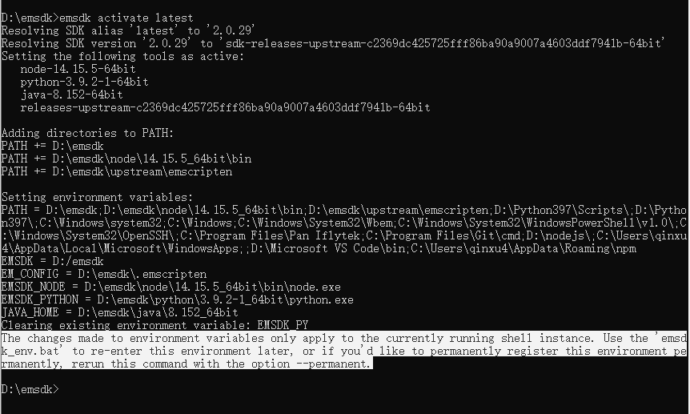
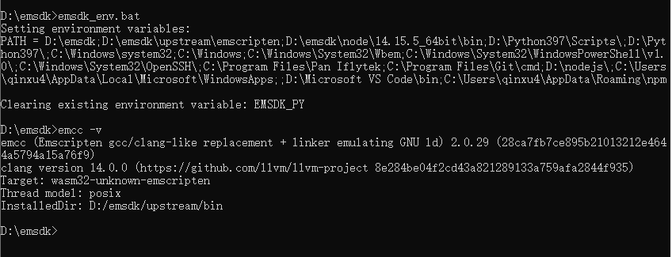
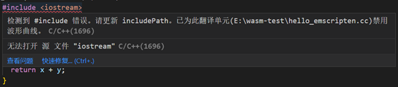
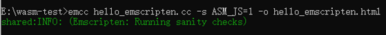
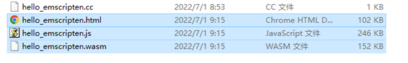
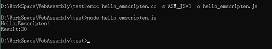
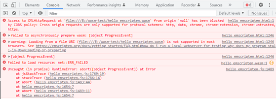
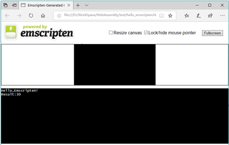

## Emscripten使用2022（ Windows 10 专业版）    

> 声明在先：本文参考掘金好文 https://juejin.im/entry/5bcd43a5e51d457a502a7554    
> 代码示例摘自书籍《深入浅出WebAssembly》(于航/著)第五章    
> 旧版2019教程在这里https://github.com/missgentle/Q-A/tree/master/Guide/Emscripten    
> Emscripten工具链是作为一个独立的Emscripten SDK分发的。SDK提供了所有必需的工具，如Clang、Python和Node.js，以及一个更新机制，允许在发布时迁移到新的Emscripten版本。    

### 1.安装Python并配置环境变量    

后面运行emsdk命令的需要，无所谓版本，我装的最新版(python3.9.7)目前看没什么问题。安装首页可以直接勾选配置PATH就不用手动配了。命令行窗口键入python –V 检查是否安装成功。
下载地址 https://www.python.org/downloads/    

### 2.下载解压emsdk    

去github上下载解压一下就可以了，没什么可说的。    
地址 https://github.com/emscripten-core/emsdk     

### 3.去emsdk下依次运行以下命令    

- 去emsdk下(我的emsdk路径D:/emsdk)：    
`d:`    
`cd emsdk`    

- 下载安装最新版sdk工具：    
`emsdk update`    
`emsdk install latest`    

这一步需要点时间十分钟应该够了。我的运行截图如下：    

    

这里可以看到输出了一行`Done installing tool 'python-3.9.2-1-64bit'.` emsdk的内置Python。    

- 激活sdk    
`emsdk activate latest`    

引用下书中原文：    
> 这里的“激活”实际上就是指将当前Emscripten工具链所需要的各种环境变量信息都写入.emscripten配置文件中，以供emcc等编译器工具使用。    

我的运行截图如下：    

    

这里可以看到都配了什么东西，最后也提示了Windows用户怎样环境变量全局化，但以防潜在的副作用：
将环境变量指向了Emscripten内置的Node.js、Python、Java，若系统中安装了这些组件的其他版本，可能引发冲突。
所以还是不全局了。不全局的弊端是以后在新建的控制台中都需要配置一次环境变量(也就是下一步👇)，才可使用Emscripten核心命令emcc。    

- 初始化环境变量    
`emsdk_env.bat`    

其实就是配环境变量。最后可以执行emcc -v检验一下。我的运行截图如下：    

    

“纸上得来终觉浅，绝知此事要躬行”。好，到此环境已经搭建好了。    

### 4.简单示例一————编译到ASM.js    

- 新建一个C文件，名为hello_emscripten.cc(我放在E:\wasm-test目录下)    

```
#include <iostream>

using namespace std;

int add(int x, int y){
return x + y;
}

int main(int argc, char **argv){
cout << "Hello,Emscripten!\n" << "Result:" << add(10, 20) << endl;
return 0;
}
```    

在vscode中编辑可能 头文件 `#include <iostream>` 会报错    

    

因为我没有安装gcc编译工具，也可能是你安装了装了visual studio，或者wsl（windows下Linux子系统），vscode会优先用前两者的编译器，如果前两个都没检测到，vscode才会使用mingw。而巧的是，万能头文件是mingw里才有的，可以自行百度搞一下，但我们用emscripten的emcc编译这里不需要管它。    


- 初始化环境变量再回到工作目录(如果本次命令窗口中已经进行过或做了全局化则略过此步骤)    

`d:`    
`cd emsdk`    
`emsdk_env.bat`    

`e:`   
`cd wasm-test`    

- 编译到ASM.js    

`emcc hello_emscripten.cc -s ASM_JS=1 -o hello_emscripten.html`    

    
    

这里的 -o hello_emscripten.html 会同时生成同名的.html,.js和.wasm文件，也可以-o hello_emscripten.js只生成.js和.wasm文件文件。
如果没有 -o xxx.xx，则默认会自动在当前目录生成一个a.out.js文件。    

我们可以直接使用node命令执行js    

`node hello_emscripten.js`    

    

也可以在Web浏览器中查看html(直接双击html文件会受到CORS限制)    

    

所以我们可以先用python启一个服务，python3命令:     

`python -m http.server 8081`    

也可以VsCode插件Live Server新建终端，自行百度吧~    

然后访问 http://localhost:8081/hello_emscripten.html  页面如下：    

    

Emscripten会在当前html中创建两个数据输区域：顶端Canvas画布主要用于测试源代码中OpenGL相关的部分功能；底部可交互区模拟出一个只能进行数据输出的命令行控制台(实际是个<textarea>)。    

### 5.简单示例二————连接C/C++与WebAssembly     

Emscripten无法将涉及浏览器层API的C/C++源程序(如使用了OpenGL技术)与独立的Wasm模块打包在一起。对此的解决办法是：只将不涉及浏览器层API接口，
仅具有纯计算和方法调用过程的代码打包到Wasm模块中；对于那些需要与浏览器进行交互或JS接口调用的代码，则将其按照普通的JS代码进行打包并交由浏览器执行。

  - Standalone类型    
  
  该类型的Wasm应用只适用于那些仅包含纯计算和方法调用逻辑的C/C++源程序。即源程序中不能有任何涉及需要与浏览器API进行交互、发送远程请求(HTTP/Socket)，
  以及与数据显示、输入等I/O相关的代码。构建该类型的Wasm应用时只会生成独立的Wasm二进制模块，而不会帮助构建任何用于连接该模块与上层JS环境的脚本文件。
  
   首先新建一个C文件，名为emscripten-standalone.cc (为了后面方便区分源文件和编译输出文件我创建一个cc目录把源文件放在E:\ wasm-test\cc目录下，另外创建一个out目录用于后面放输出文件）    

   ```
   //"胶水工具" 解决了大多数原生到Web的跨平台问题
   #include <emscripten.h>
    
   //条件编译 在C++编译器中以C语言的规则来处理代码，防止Name Mangling处理
   #ifdef __cplusplus
   extern "C"{
   #endif
    
   //利用宏防止函数被DCE
   EMSCRIPTEN_KEEPALIVE int add(int x, int y){
   return x + y;
   }
    
   #ifdef __cplusplus
   }
   #endif
   ```    
   
   原以为这里的__cplusplus是一个_，后来看到编译出来的方法名还是经过了Name Mangling，才发现这是两个_。
    
  构建Standalone类型的Wasm应用有两种方式：
  
   1 使用增强型优化器的方式(Optimizer)    
    `emcc cc/emscripten-standalone.cc -Os -s WASM=1 -o out/emscripten-standalone-optimizer.wasm`    
    
   其中-Os参数是优化的关键，该参数告知编译器以“第4等级”的优化策略优化目标代码，进而删除其中没有被用到并且与ERE(Emscripten Runtime Environment, Emscripten运行时环境)相关的所有信息。但这种方式可能并不适用于功能较为复杂或使用了C++11及以上版本语法特性的Wasm应用。WASM=1标识用于设置编译器生成目标文件类型为wasm二进制模块。    
    
      
      
  
   接下来，给出HTML与JS脚本代码index-optimizer.html(E:\ wasm-test\html目录下)：：    
   ```
   <!DOCTYPE html>
   <html>
   <head>
     <title>Emscripten - Standalone WebAssembly Module - Optimizer</title>
   </head>
   <body>
     <script type="text/javascript">
       // 远程加载wasm模块
       fetch('../out/emscripten-standalone-optimizer.wasm').then(
         response => response.arrayBuffer()
       ).then(bytes =>
         // 没有需要向模块中导入的内容
         WebAssembly.instantiate(bytes, {})
       ).then(result => {
         // 从exports对象中获取模块对外暴露出的add方法
         const exportFuncAdd = result.instance.exports['_add'];
         // 调用add方法
         console.log(exportFuncAdd(10, 20));
       })
     </script>
   </body>
   </html>
   ```    
    
   注意，在Name Mangling特性不生效的情况下，Emscripten会给导出的函数的函数名前加上下划线做前缀，因此从exports对象中获取导出函数时需要使用“_add”.    

   访问 http://127.0.0.1:8081/html/index-optimizer.html    
	
       
   
   2 编译成动态库的方式(Dynamic Library)    
    `emcc cc/emscripten-standalone.cc -s WASM=1 -s SIDE_MODULE=1 -o out/emscripten-standalone-dynamic.wasm`    
    编译命令添加SIDE_MODULE=1标识让Emscripten将C/C++源代码文件编译成一个WebAssembly动态链接库。    
  
   这里再添加一个index-dynamic.html：    
   
   ```
<!DOCTYPE html>
<html>
<head>
	<title>Emscripten - Standalone WebAssembly Module - Dynamic</title>
</head>
<body>
	<script type="text/javascript">
		// 远程加载wasm模块
		fetch('../out/emscripten-standalone-dynamic.wasm').then(
			response => response.arrayBuffer()
		).then(bytes =>
			WebAssembly.instantiate(bytes, {
				// 向模块中导入用于初始化的env模块对象
				env: {
					memoryBase: 0,
					tableBase: 0,
					table: new WebAssembly.Table({
						initial: 2,
						element: 'anyfunc'
					}),
					abort: function(msg){
						console.error(msg);
					}
				}
			})
		).then(result => {
			// 从exports对象中获取模块对外暴露出的add方法
			const exportFuncAdd = result.instance.exports['_add'];
			// 调用add方法
			let outcome = exportFuncAdd(10, 20);
			console.log(outcome);
		})
	</script>
</body>
</html>
   ```    
   与Optimizer方式不同的是，这里需要在初始化wasm模块时，向其内部导入包含模块初始化资源的env命名空间对象，在这个对象中我们为模块提供了Table对象结构以及相关的初始化参数。    

  - Dependent类型    
  
  Dependent类型与Standalone类型有所不同的是，该类型应用中一般含有大量与浏览器特定功能相关的方法调用。
  比如C/C++源代码中使用了IO标准库，OpenGL等需要与宿主环境本身进行交互的相关技术。这部分代码需要Emscripten进行单独处理。    
  
  另外，由于wasm模块本身无法直接与浏览器进行交互，因此，Emscripten需要通过某种具有类似“胶水”功能的JS代码，
  来将wasm模块与web浏览器在功能交互和数据资源传输层面连接起来。但这部分工作会由Emscripten来帮助我们完成。
  
  首先，新建一个C文件，名为emscripten-dependent.cc(我还是放在E:\wasm-test\cc目录下)    
  
   ```
    #include <emscripten.h>
    #include <iostream>
    
    using namespace std;
    
    #ifdef __cplusplus
    extern "C"{
    #endif
    
    EMSCRIPTEN_KEEPALIVE void echo(int x){
    cout << "The number you input is: " << x << endl;
    }
    
    #ifdef __cplusplus
    }
    #endif
 ```    
  
这里使用了cout对象来向控制台打印上层JS环境传入的一个整型数据，即使用了C/C++源代码中使用了IO标准库。    

接下来，我们通过一段js代码来调用后续wasm模块暴露出的函数，以及其他相关主流程代码。    
post-script.js文件(E:\wasm-test\js目录下)：    

```
//向Module初始化完毕的钩子队列中加入待执行的内容
__ATPOSTRUN__.push(() => {
	//调用模块中暴露出的echo方法
	Module.ccall('echo', null, ['number'], [10]);
	//也可以这样调用
	Module['asm']['_echo'](10);
})
```    
由于Emscripten会自动生成用于连接模块与浏览器的JS脚本，因此，我们不需要考虑应该如何加载模块，以及如何为模块提供初始化数据。只需要编写模块初始化后需要执行的主流程代码即可。    
这里我们通过Module.ccall全局函数调用了echo方法，Module.ccall就是由自动生成的脚本文件中封装好的“胶水”方法，用于调用模块内部函数。    
代码中还使用了名为__ATPOSTRUN__的数组结构，放入该数组结构中的函数会在模块和ERE初始化完成后依次执行。因此改数组结构也被称为ERE内部的一个生命周期钩子(Hook)队列。    
ERE内部定义了多种类型的钩子队列结构，放入这些队列的函数会在ERE的生命周期的特定阶段被执行。    

```
var __ATPRERUN__ = [] // functions called before the runtime is initialized
var __ATINIT__  = [] // functions called during startup
var __ATMAIN__  = [] // functions called when main() is to be run 
var __ATEXIT__  = [] // functions called during shutdown
var __ATPOSTRUN__  = [] // functions called after the runtime has exited
```    

之后，我们执行命令编译C代码：      
  `emcc cc/emscripten-dependent.cc -s WASM=1 -s EXPORTED_RUNTIME_METHODS=[ccall] --post-js js/post-script-dependent.js -o out/emscripten-dependent.js`     
EXPORTED_RUNTIME_METHODS 标识以数组形式记录所有需要被导出的Emscripten运行时方法，以便Emscripten能够将这些方法的定义直接绑定到全局的Module对象中。    
--post-js参数用于指定需要被追加到“胶水”脚本文件的JS代码，将被拼接到“胶水文件的尾部”；使用--pre-js编译参数可添加需要在Module对象初始化前执行的JS代码，即追加到脚本文件的头部。    

    

最后，通过html文件整合wasm模块index-dependent.html ：    

```
<!DOCTYPE html>
<html lang="en">
<head>
	<meta charset="utf-8">
	<title>Emscripten - Dependent WebAssembly Module</title>
</head>
<body>
	<script type="text/javascript">
		//初始化Module全局对象，由Emscrpten自动完成内容填充
		var Module = {};

		fetch('../out/emscripten-dependent.wasm').then(
			response => response.arrayBuffer()
			).then((bytes) => {
				//填充模块数据
				Module.wasmBinary = bytes;
				//动态异步载入Emscrpten生成的“胶水”脚本文件
				var script = document.createElement('script');
				script.src = "emscripten-dependent.js";
				document.body.appendChild(script);
			});
	</script>
</body>
</html>
```    

与Standalone类型初始化不同，这里需要在加载脚本文件之前使用远程获取的wasm二进制数据填充Module全局对象的wasmBinary属性，
再通过动态加载的方式将“胶水”脚本文件绑定并加载到当前的html中。    

“胶水”脚本文件中的代码在执行时会自动检测当前全局作用域是否存在名为Module的JS对象，以及该对象的wasmBinary属性是否包含一段有效的wasm模块二进制数据。    
若一切正常，则脚本文件会自动完成ERE初始化，模块加载和实例化等过程，并在相应时期依次执行各钩子队列中的方法。    

    

想深入了解wasm编译流程的可以啃啃源码：`emsdk\fastcomp\emscripten\tools\shared.py`    
