## Emscripten的安装使用教程    

> 声明在先：本文参考掘金好文 https://juejin.im/entry/5bcd43a5e51d457a502a7554    
> 代码示例摘自书籍《深入浅出WebAssembly》(于航/著)第五章

首先想吐槽一下，《深入浅出WebAssembly》书中第五章介绍的安装步骤有点坑，而且只针对MasOS让我感到心里苦(T_T)。
网上一堆千篇一律的文章也让人头疼，也不知道是不是真实实践得来的(+\_+)?好了不再多BB了，开始我的表演。    

### 1.安装Python并配置环境变量    

我说书里坑有一点就在这里，根本没提要安装Python。也无所谓什么版本，网上大多说因为emsdk是一组基于Python 2的脚本所以要安Python 2.7.12。
而实际情况是我装了最新版(3.7.4)也没什么问题，而且我觉得理论上可能只要高于2.7.12就可以。安装首页可以以直接勾选配置PATH就不用手动配了。
下载地址https://www.python.org/downloads/    

### 2.下载解压emsdk    

去github上下载解压一下就可以了，没什么可说的。地址https://github.com/emscripten-core/emsdk 也可以用git命令    

### 3.去emsdk下依次运行以下命令    

- 去emsdk下(我的emsdk路径D:/SoftWare/emsdk)：    
`d:`    
`cd SoftWare/emsdk`    

- 下载安装最新版sdk工具：    
`emsdk update`    
`emsdk install latest`    

书里坑第二点这里根本没提emsdk update命令。我一开始按照书上的步骤，提示我'python' 不是内部或外部命令了我才知道要安装Python。
安装完Python直接运行emsdk install latest还是不成功提示`Error: Downloading URL 'https://storage.googleapis.com/webassembly/emscripten-releases-builds/win/bc367c257409d676e71c5511383228b7aabf1689/wasm-binaries.zip': <urlopen error [WinError 10060] 
由于连接方 在一段时间后没有正确答复或连接的主机没有反应，连接尝试失败。> Installation failed!`    
我还以为是因为要翻墙，准备去找国内镜像了。
结果找到文章开头的文章，才知道原来还需要先emsdk update。
但这里也不必将emsdk替换成emsdk.bat，也没有网上说的要下一个小时，我只等了大概十分钟。我的运行截图如下：    

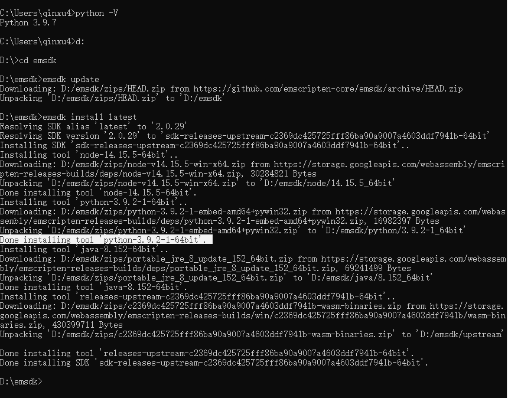    

这里可以看到输出了一行`Done installing tool 'python-2.7.13.1-64bit'.`这么看来，可能之前提到网上说的Python版本是从这来的？。。。
然而一个我们为了运行emsdk命令，一个是emsdk的内置Python，我觉得这两个地方并没有半毛钱关系。    

- 激活sdk    
`emsdk activate latest`    

引用下书中原文：    
> 这里的“激活”实际上就是指将当前Emscripten工具链所需要的各种环境变量信息都写入.emscripten配置文件中，以供emcc等编译器工具使用。    

我的运行截图如下：    

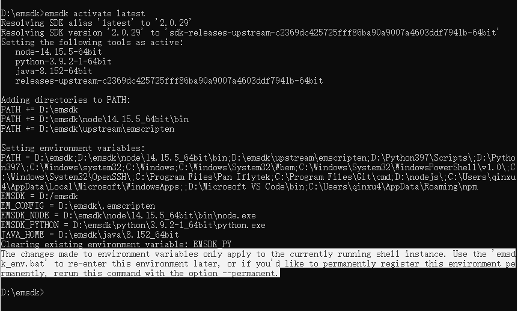    

这里可以看到都配了什么东西，最后也提示了Windows用户怎样环境变量全局化，但以防潜在的副作用：
将环境变量指向了Emscripten内置的Node.js、Python、Java，若系统中安装了这些组件的其他版本，可能引发冲突。
所以还是不全局的好。不全局的弊端是以后在新建的控制台中都需要配置一次环境变量(也就是下一步👇)，才可使用Emscripten核心命令emcc。    

- 初始化环境变量    
`emsdk_env.bat`    

其实就是配环境变量，省的自己手动去配了。但这里Windows就不能使用source ./emsdk_env.sh了。最后可以执行emcc -v检验一下。我的运行截图如下：    

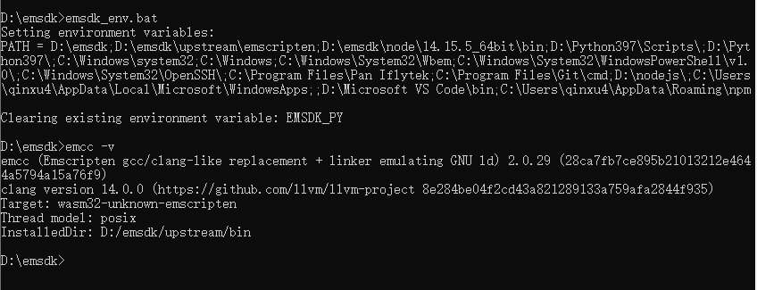    

“纸上得来终觉浅，绝知此事要躬行”。好，到此环境已经搭建好了。

### 4.简单示例一————编译到ASM.js    

- 新建一个C文件，名为hello_emscripten.cc(我放在D:\WorkSpace\WebAssembly\test目录下)    

```
#include <iostream>

using namespace std;

int add(int x, int y){
return x + y;
}

int main(int argc, char **argv){
cout << "Hello,Emscripten!\n" << "Result:" << add(10, 20) << endl;
return 0;
}
```    

- 初始化环境变量再回到工作目录(如果本次命令窗口中已经进行或做了全局化则略过此步骤)    

`cd D:\SoftWare\emsdk`    
`emsdk_env.bat`    

`cd D:\WorkSpace\WebAssembly\test`    

- 编译到ASM.js    

`emcc hello_emscripten.cc -s ASM_JS=1 -o hello_emscripten.html`    

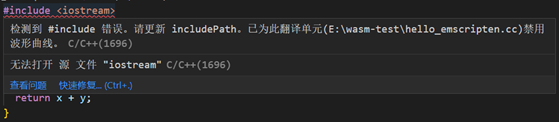    
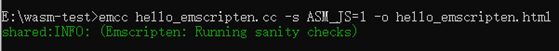    

这里的 -o hello_emscripten.html 会同时生成同名的.html,.js和.wasm文件，也可以-o hello_emscripten.js只生成.js和.wasm文件文件。
如果没有 -o xxx.xx，则默认会自动在当前目录生成一个a.out.js文件。    

我们可以直接使用node命令执行js    

`node hello_emscripten.js`    

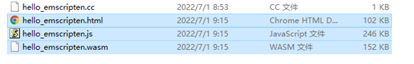    

也可以在Web浏览器中运行(直接双击html文件)    

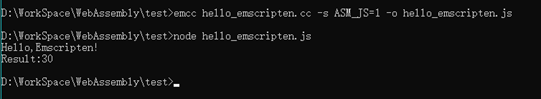    

Emscripten会在当前html中创建两个数据输区域：顶端Canvas画布主要用于测试源代码中OpenGL相关的部分功能；底部可交互区模拟出一个只能进行数据输出的命令行控制台。    

 > ASM.js模块类型声明标识：“use asm”与“almost asm”

“use asm”告诉浏览器定义的函数内部所有代码都遵循ASM.js的语法和规则，即将其视为一个标准的ASM.js模块。这样才浏览器内部的JS引擎才会按照ASM.js模块的数据分配与编译方式来执行定义在该模块内的方法。    
而实际上，浏览器对ASM.js代码的可优化条件非常严格。一旦某些语法格式或边界条件没有满足要求，整个ASM.js代码就会直接退化为正常的JS代码，大大降低了执行效率。    
所以在Emscripten工具链中，对于一些因为含有特殊语法结构而无法被转译为标准ASM.js模块的C/C++源程序，Emscripten会将其对应的ASM.js模块类型声明标识改写为“almost asm”，以表示该ASM.js模块不可被优化。

### 4.简单示例二————连接C/C++与WebAssembly     

Emscripten无法将涉及浏览器层API的C/C++源程序(如使用了OpenGL技术)与独立的Wasm模块打包在一起。对此的解决办法是：只将不涉及浏览器层API接口，
仅具有纯计算和方法调用过程的代码打包到Wasm模块中；对于那些需要与浏览器进行交互或JS接口调用的代码，则将其按照普通的JS代码进行打包并交由浏览器执行。

  - Standalone类型    
  
  该类型的Wasm应用只适用于那些仅包含纯计算和方法调用逻辑的C/C++源程序。即源程序中不能有任何涉及需要与浏览器API进行交互、发送远程请求(HTTP/Socket)，
  以及与数据显示、输入等I/O相关的代码。构建该类型的Wasm应用时只会生成独立的Wasm二进制模块，而不会帮助构建任何用于连接该模块与上层JS环境的脚本文件。
  
   首先，新建一个C文件，名为emscripten-standalone.cc(我还是放在D:\WorkSpace\WebAssembly\test目录下)    
    
   ```
   //"胶水工具" 解决了大多数原生到Web的跨平台问题
   #include <emscripten.h>
    
   //条件编译 在C++编译器中以C语言的规则来处理代码，防止Name Mangling处理
   #ifdef __cplusplus
   extern "C"{
   #endif
    
   //利用宏防止函数被DCE
   EMSCRIPTEN_KEEPALIVE int add(int x, int y){
   return x + y;
   }
    
   #ifdef __cplusplus
   }
   #endif
   ```    
   
   原以为这里的__cplusplus是一个_，后来看到编译出来的方法名还是经过了Name Mangling，才发现这是两个_。
    
  构建Standalone类型的Wasm应用有两种方式：
  
   1 使用增强型优化器的方式(Optimizer)    
    `emcc emscripten-standalone.cc -Os -s WASM=1 -o emscripten-standalone-optimizer.wasm`    
    
   其中-Os参数是优化的关键，该参数告知编译器以“第4等级”的优化策略优化目标代码，进而删除其中没有被用到并且与ERE(Emscripten Runtime Environment, Emscripten运行时环境)相关的所有信息。但这种方式可能并不适用于功能较为复杂或使用了C++11及以上版本语法特性的Wasm应用。WASM=1标识用于设置编译器生成目标文件类型为wasm二进制模块。    
    
  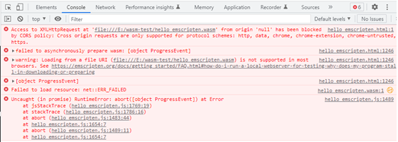    
  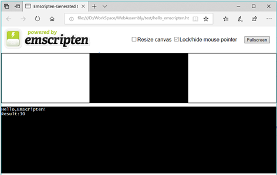    
  
   接下来，给出HTML与JS脚本代码index-optimizer.html：    
   ```
   <!DOCTYPE html>
   <html>
   <head>
     <title>Emscripten - Standalone WebAssembly Module - Optimizer</title>
   </head>
   <body>
     <script type="text/javascript">
       // 远程加载wasm模块
       fetch('emscripten-standalone-optimizer.wasm').then(
         response => response.arrayBuffer()
       ).then(bytes =>
         // 没有需要向模块中导入的内容
         WebAssembly.instantiate(bytes, {})
       ).then(result => {
         // 从exports对象中获取模块对外暴露出的add方法
         const exportFuncAdd = result.instance.exports['_add'];
         // 调用add方法
         console.log(exportFuncAdd(10, 20));
       })
     </script>
   </body>
   </html>
   ```    
    
   注意，在Name Mangling特性不生效的情况下，Emscripten会给导出的函数的函数名前加上下划线做前缀，因此从exports对象中获取导出函数时需要使用“_add”.
    
   但这次因为使用了fetch远程加载，直接双击html文件打开会受到CORS限制，所以需要启服务将我们的html和wasm部署在web上。
   简单的，可以使用命令`python -m SimpleHTTPServer 8081`在当前目录临时启动一个http服务，即可访问http://127.0.0.1:8081/index-optimizer.html    
   也可使用wildfly进行部署，具体参照wildfly教程前6步：  https://github.com/missgentle/Q-A/tree/master/Guide/wildfly    
   
   这里我都以wildfly方法为例，将html和wasm拷贝到本地路径D:\SoftWare\wildfly-15.0.0.Final\ux下，启动wildfly，
   访问http://127.0.0.1:8080/ux/index-optimizer.html 
   F12控制台输出如下：
    
   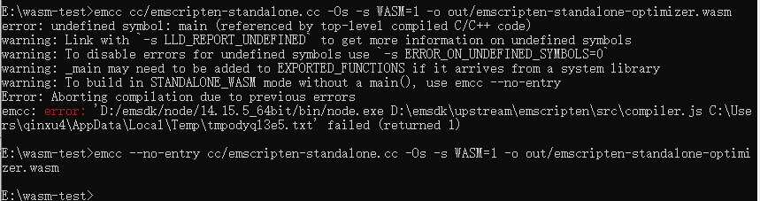    

   2 编译成动态库的方式(Dynamic Library)----(这个方式没成功，应该就是env对象那里有问题，但还是目前还是没搞定)    
    `emcc emscripten-standalone.cc -s WASM=1 -s SIDE_MODULE=1 -o emscripten-standalone-dynamic.wasm`    
    编译命令添加SIDE_MODULE=1标识让Emscripten将C/C++源代码文件编译成一个WebAssembly动态链接库。    
  
   这里再添加一个index-dynamic.html：    
   
   ```
<!DOCTYPE html>
<html>
<head>
	<title>Emscripten - Standalone WebAssembly Module - Dynamic</title>
</head>
<body>
	<script type="text/javascript">
		// 远程加载wasm模块
		fetch('emscripten-standalone-dynamic.wasm').then(
			response => response.arrayBuffer()
		).then(bytes =>
			WebAssembly.instantiate(bytes, {
				// 向模块中导入用于初始化的env模块对象
				env: {
					memoryBase: 0,
					tableBase: 0,
					table: new WebAssembly.Table({
						initial: 2,
						element: 'anyfunc'
					}),
					abort: function(msg){
						console.error(msg);
					}
				}
			})
		).then(result => {
			// 从exports对象中获取模块对外暴露出的add方法
			const exportFuncAdd = result.instance.exports['_add'];
			// 调用add方法
			let outcome = exportFuncAdd(10, 20);
			console.log(outcome);
		})
	</script>
</body>
</html>
   ```    
   与Optimizer方式不同的是，这里需要在初始化wasm模块时，向其内部导入包含模块初始化资源的env命名空间对象，在这个对象中我们为模块提供了Table对象结构以及相关的初始化参数。    

  - Dependent类型    
  
  Dependent类型与Standalone类型有所不同的是，该类型应用中一般含有大量与浏览器特定功能相关的方法调用。
  比如C/C++源代码中使用了IO标准库，OpenGL等需要与宿主环境本身进行交互的相关技术。这部分代码需要Emscripten进行单独处理。    
  
  另外，由于wasm模块本身无法直接与浏览器进行交互，因此，Emscripten需要通过某种具有类似“胶水”功能的JS代码，
  来将wasm模块与web浏览器在功能交互和数据资源传输层面连接起来。但这部分工作会由Emscripten来帮助我们完成。
  
  首先，新建一个C文件，名为emscripten-dependent.cc(我还是放在D:\WorkSpace\WebAssembly\test目录下)    
  
   ```
    #include <emscripten.h>
    #include <iostream>
    
    using namespace std;
    
    #ifdef __cplusplus
    extern "C"{
    #endif
    
    EMSCRIPTEN_KEEPALIVE void echo(int x){
    cout << "The number you input is: " << x << endl;
    }
    
    #ifdef __cplusplus
    }
    #endif
 ```    
  
这里使用了cout对象来向控制台打印上层JS环境传入的一个整型数据，即使用了C/C++源代码中使用了IO标准库。    

接下来，我们通过一段js代码来调用后续wasm模块暴露出的函数，以及其他相关主流程代码。    
post-script.js文件：    

```
//向Module初始化完毕的钩子队列中加入待执行的内容
__ATPOSTRUN__.push(() => {
	//调用模块中暴露出的echo方法
	Module.ccall('echo', null, ['number'], [10]);
	//也可以这样调用
	Module['asm']['_echo'](10);
})
```    
由于Emscripten会自动生成用于连接模块与浏览器的JS脚本，因此，我们不需要考虑应该如何加载模块，以及如何为模块提供初始化数据。
只需要编写模块初始化后需要执行的主流程代码即可。    
这里我们通过Module.ccall全局函数调用了echo方法，Module.ccall就是由自动生成的脚本文件中封装好的“胶水”方法，用于调用模块内部函数。    
代码中还使用了名为__ATPOSTRUN__的数组结构，放入该数组结构中的函数会在模块和ERE初始化完成后依次执行。
因此改数组结构也被称为ERE内部的一个生命周期钩子(Hook)队列。    
ERE内部定义了多种类型的钩子队列结构，放入这些队列的函数会在ERE的生命周期的特定阶段被执行。    

```
var __ATPRERUN__ = [] // functions called before the runtime is initialized
var __ATINIT__  = [] // functions called during startup
var __ATMAIN__  = [] // functions called when main() is to be run 
var __ATEXIT__  = [] // functions called during shutdown
var __ATPOSTRUN__  = [] // functions called after the runtime has exited
```    

之后，我们执行命令编译C代码 (不知道是不是系统原因，反正我windows系统用书上给的命令会报错)：      
  `emcc emscripten-dependent.cc -s WASM=1 -s EXTRA_EXPORTED_RUNTIME_METHODS=[ccall] --post-js post-script.js -o emscripten-dependent.js`     
EXTRA_EXPORTED_RUNTIME_METHODS 标识以数组形式记录所有需要被导出的Emscripten运行时方法，
以便Emscripten能够将这些方法的定义直接绑定到全局的Module对象中。    
--post-js参数用于指定需要被追加到“胶水”脚本文件的JS代码，将被拼接到“胶水文件的尾部”；
使用--pre-js编译参数可添加需要在Module对象初始化前执行的JS代码，即追加到脚本文件的头部。    

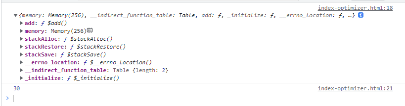    

最后，通过html文件整合wasm模块index-dependent.html ：    

```
<!DOCTYPE html>
<html lang="en">
<head>
	<meta charset="utf-8">
	<title>Emscripten - Dependent WebAssembly Module</title>
</head>
<body>
	<script type="text/javascript">
		//初始化Module全局对象，由Emscrpten自动完成内容填充
		var Module = {};

		fetch('emscripten-dependent.wasm').then(
			response => response.arrayBuffer()
			).then((bytes) => {
				//填充模块数据
				Module.wasmBinary = bytes;
				//动态异步载入Emscrpten生成的“胶水”脚本文件
				var script = document.createElement('script');
				script.src = "emscripten-dependent.js";
				document.body.appendChild(script);
			});
	</script>
</body>
</html>
```    

与Standalone类型初始化不同，这里需要在加载脚本文件之前使用远程获取的wasm二进制数据填充Module全局对象的wasmBinary属性，
再通过动态加载的方式将“胶水”脚本文件绑定并加载到当前的html中。    

“胶水”脚本文件中的代码在执行时会自动检测当前全局作用域是否存在名为Module的JS对象，以及该对象的wasmBinary属性是否包含一段有效的wasm模块二进制数据。
若一切正常，则脚本文件会自动完成ERE初始化，模块加载和实例化等过程，并在相应时期依次执行各钩子队列中的方法。

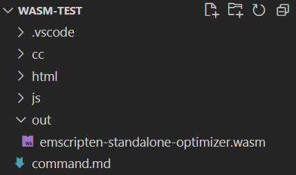    

想深入了解wasm编译流程的可以啃啃源码：emsdk\fastcomp\emscripten\tools\shared.py    
